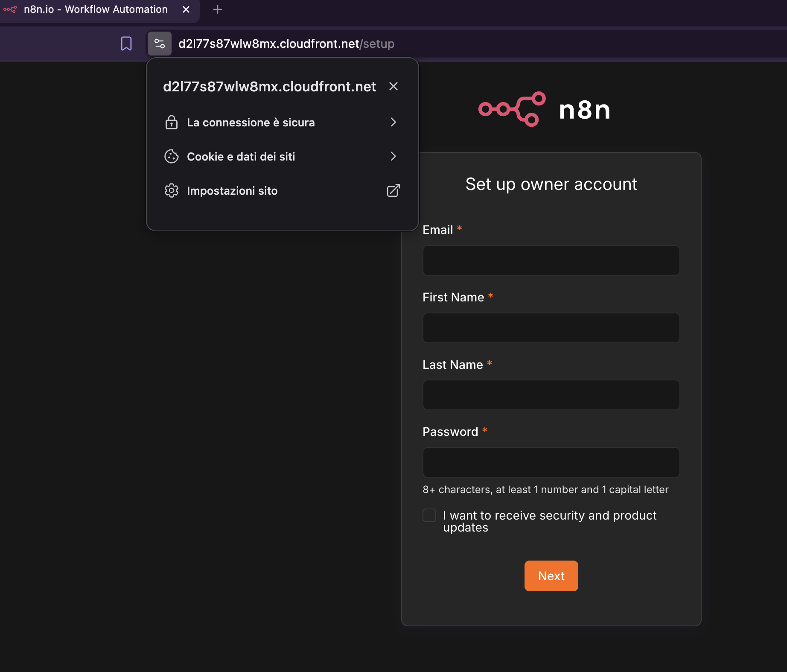
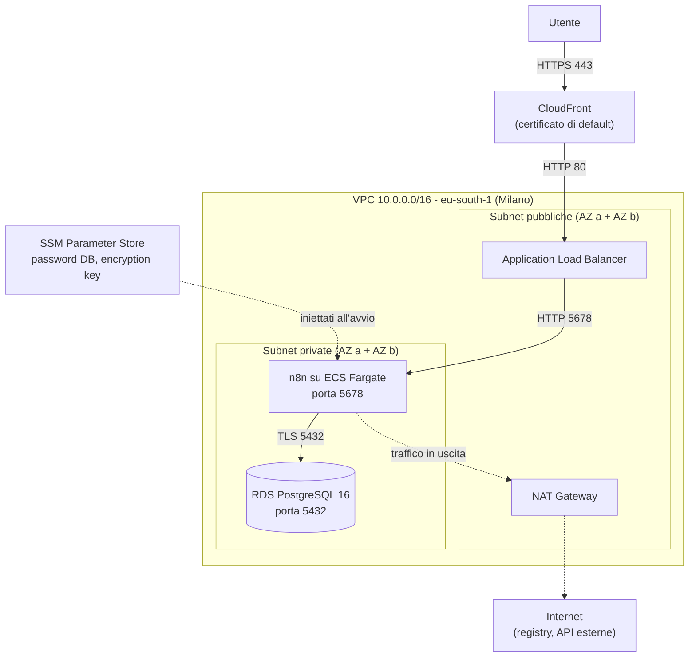
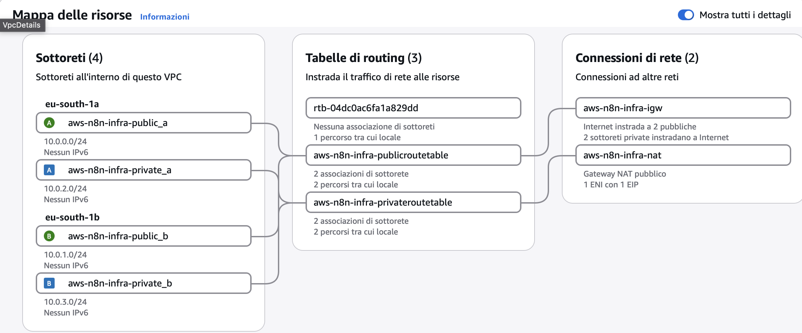
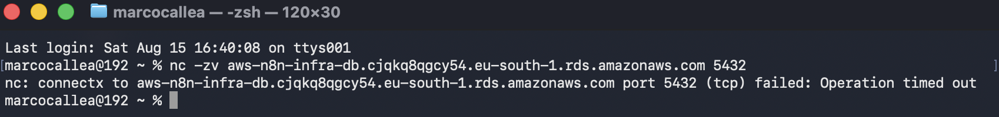
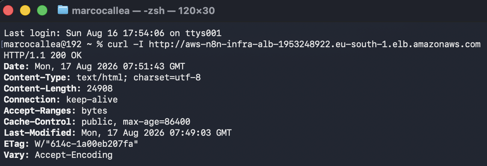
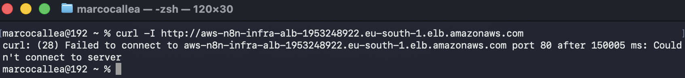

# Self-hosted n8n su AWS

[](https://github.com/marcocallea/aws-n8n-infra/actions)

Infrastruttura completa per eseguire [n8n](https://n8n.io) (piattaforma open source di workflow automation) su AWS, definita al 100% in Terraform.

Lo scenario di partenza è concreto: n8n è lo strumento con cui molte aziende collegano automazioni e modelli AI ai propri sistemi, e proprio per questo al suo interno transitano credenziali di posta, API key e dati dei clienti. Chi non vuole affidare quella roba a un SaaS esterno se lo ospita in casa, cioè nel proprio account cloud. Questo repository è il deployment di quello scenario, fatto come andrebbe fatto: rete segmentata, database non esposto, segreti fuori dal codice, security scanning in CI.

Il container di n8n è preso così com'è dal registry ufficiale. Il lavoro sta tutto nell'infrastruttura che ci gira intorno.



## Architettura



Il percorso di una richiesta: l'utente arriva su CloudFront, che termina il TLS e inoltra al load balancer nelle subnet pubbliche. L'ALB consegna al container di n8n, che vive in una subnet privata senza indirizzo pubblico, e che a sua volta parla con il database su una connessione cifrata. L'unico traffico nella direzione opposta è quello in uscita del container, che passa dal NAT gateway per scaricare la propria immagine e per chiamare le API dei workflow.



## Struttura del repository

```
bootstrap/          bucket S3 per lo state remoto e budget alert (si applica una volta sola)
envs/prod/          composizione dei moduli, backend S3, variabili dell'ambiente
modules/
  network/          VPC, 4 subnet su 2 AZ, IGW, NAT, route table
  security/         i tre security group e le regole che li collegano
  rds/              subnet group, istanza PostgreSQL, password generata e salvata in SSM
  ecs-n8n/          cluster, ruolo IAM di esecuzione, task definition, service
  alb/              load balancer, target group, listener
  cloudfront/       distribuzione con certificato di default
```

I security group stanno in un modulo a parte invece che dentro i moduli che li usano. La ragione è pratica: il security group del database deve referenziare quello di ECS, che a sua volta referenzia quello dell'ALB. Tenendoli insieme, e definendo le regole come risorse separate (`aws_vpc_security_group_ingress_rule`) invece che come blocchi inline, la catena si legge in un file solo e non si creano dipendenze circolari fra moduli.

## Scelte e compromessi

**Un solo NAT gateway invece di uno per zona.** Un NAT per AZ sarebbe la configurazione corretta in produzione, perché così la caduta di una zona non blocca il traffico in uscita dell'altra. Ne ho messo uno solo: costa circa 35 dollari al mese in meno e il single point of failure riguarda solo l'egress, non la raggiungibilità del servizio. In un ambiente reale la scelta cambierebbe.

**Niente HTTPS fra CloudFront e ALB.** Il TLS termina su CloudFront e il tratto interno viaggia in HTTP. È accettabile perché quel tratto resta dentro l'infrastruttura AWS e perché l'ALB accetta connessioni solo dalla prefix list di CloudFront, quindi non è raggiungibile direttamente da internet. Per cifrare anche quel tratto servirebbe un certificato ACM sull'ALB, e per un certificato serve un dominio.

**CloudFront con il certificato di default.** Non avendo assegnato un dominio al progetto, uso il certificato incluso su `*.cloudfront.net`. Il limite noto è che con questo certificato la versione minima di TLS lato client la decide AWS e non è configurabile. Con un dominio dedicato userei ACM e un certificato custom.

**Il caching è disattivato.** CloudFront qui non serve a distribuire contenuti statici ma a fornire HTTPS e a fare da unico punto di ingresso. n8n è un'applicazione autenticata: mettere in cache le risposte significherebbe rischiare di servire la sessione di un utente a un altro. Uso quindi le policy gestite `CachingDisabled` e `AllViewer`, che inoltrano tutto all'origine.

**SSM Parameter Store invece di Secrets Manager.** I parametri di tipo SecureString del tier standard sono gratuiti, Secrets Manager costa circa 0,40 dollari al mese per segreto. Quello che perdo è la rotazione automatica delle credenziali, che in un ambiente che viene distrutto e ricreato ogni giorno non ha molto senso.

**Database single-AZ, istanza t4g.micro.** Scelta di costo. Il Multi-AZ raddoppierebbe la spesa dell'istanza per un ambiente che non ha requisiti di continuità.

**Niente queue mode.** n8n può girare con worker separati e Redis per gestire molte esecuzioni concorrenti. Qui gira in istanza singola, che è la configurazione supportata per volumi bassi. La modalità a coda è nella roadmap.

## Sicurezza

**La catena dei security group.** Ogni livello autorizza solo il precedente, e le regole referenziano altri security group invece che intervalli di indirizzi. Questo vuol dire che l'autorizzazione segue l'identità della risorsa e non la sua posizione di rete, quindi resta valida anche quando i container cambiano indirizzo a ogni riavvio.

```
Internet -> ALB          porta 80, solo dalla prefix list di CloudFront
ALB      -> ECS          porta 5678, solo dal security group dell'ALB
ECS      -> RDS          porta 5432, solo dal security group di ECS
```

**Il database non è raggiungibile dall'esterno.** Sta in subnet privata con `publicly_accessible = false`. Verificato provando a connettersi dall'esterno con il proprio endpoint, che va in timeout:



**CloudFront non si può scavalcare.** Prima di stringere il security group, il load balancer rispondeva a chiunque:



Dopo aver sostituito la regola aperta a `0.0.0.0/0` con la prefix list gestita `com.amazonaws.global.cloudfront.origin-facing`, lo stesso indirizzo non risponde più, mentre il servizio continua a funzionare normalmente tramite CloudFront:



**I segreti non sono mai nel codice.** La password del database e la chiave di cifratura di n8n vengono generate da Terraform con `random_password`, salvate come SecureString in Parameter Store e iniettate nel container tramite il campo `secrets` della task definition, che accetta l'ARN del parametro e non il valore. Nel repository non compare nessuna credenziale.

La chiave `N8N_ENCRYPTION_KEY` in particolare va fissata dall'esterno: n8n la usa per cifrare le credenziali che gli utenti salvano nei workflow, e se non gliela si fornisce ne genera una nuova a ogni avvio, rendendo illeggibili le credenziali salvate in precedenza. È il motivo per cui un container usa e getta ha comunque bisogno di uno stato esterno.

**Due ruoli IAM distinti.** L'execution role serve alla piattaforma ECS per avviare il container: scaricare l'immagine, scrivere i log e leggere i due parametri da SSM. La policy per SSM elenca i due ARN specifici, non un asterisco. Il task role, cioè quello che l'applicazione userebbe per parlare con AWS mentre è in esecuzione, non esiste: n8n non ha bisogno di alcun permesso verso l'account.

**Cifratura.** Storage RDS cifrato at rest, connessione al database in TLS, parametri SSM di tipo SecureString, bucket dello state cifrato e con versioning. Le chiavi sono quelle gestite da AWS, non chiavi dedicate.

**Il security group di default della VPC è svuotato.** AWS ne crea uno permissivo insieme a ogni VPC; Terraform lo adotta con `aws_default_security_group` e lo lascia senza regole.

**Response headers policy su CloudFront**, la policy gestita `SecurityHeadersPolicy`, che aggiunge HSTS e gli header di protezione standard.

## Security scanning

La pipeline esegue checkov su ogni push e pull request, con `soft_fail: false`, quindi un finding nuovo blocca la build.

Stato attuale: 103 controlli superati, 0 falliti, 38 saltati con motivazione scritta nel codice.

I 38 skip non sono un modo per far diventare verde il badge. Ognuno ha un commento che spiega la ragione, e ricadono in tre gruppi.

Il primo gruppo è fatto di controlli che hanno senso in produzione ma non in un ambiente che nasce e muore ogni giorno: deletion protection su ALB e RDS, Multi-AZ, retention dei log a un anno.

Il secondo gruppo è fatto di controlli il cui costo non è giustificato qui: WAF, access log di ALB e CloudFront (richiederebbero un bucket dedicato), chiavi KMS gestite dall'utente al posto di quelle gestite da AWS, Performance Insights ed enhanced monitoring su RDS.

Il terzo gruppo sono controlli non applicabili. `CKV_AWS_336` chiede un filesystem di root in sola lettura, ma n8n scrive i propri dati in `/home/node/.n8n` e il container non partirebbe. `CKV_AWS_161` chiede l'autenticazione IAM verso il database, che n8n non supporta.

A parte, due falsi positivi che vale la pena segnalare perché mostrano i limiti dell'analisi statica. `CKV_AWS_260` segnala un ingresso da `0.0.0.0/0` sulla porta 80 nella regola dell'ALB, ma quella regola usa `prefix_list_id` e checkov non risolve le prefix list. `CKV2_AWS_5` sostiene che i security group non siano collegati a nulla, mentre lo sono attraverso variabili passate fra moduli, che lo strumento non segue.

Oltre a checkov, la pipeline esegue `terraform fmt -check`, `terraform validate` e tflint. Nessuno di questi job usa credenziali AWS: `validate` gira con `-backend=false`, quindi la CI non tocca l'account.

## Costi

Costo indicativo con l'infrastruttura accesa, regione eu-south-1:

| Componente | Circa USD/ora |
|---|---|
| NAT Gateway | 0,05 |
| Application Load Balancer | 0,03 |
| Fargate 0.5 vCPU / 1 GB | 0,03 |
| RDS db.t4g.micro + 20 GB gp3 | 0,02 |
| **Totale acceso** | **circa 0,13** |

Che vuol dire circa 95 dollari al mese se restasse acceso in continuazione, e circa 50 centesimi per una sessione di lavoro di quattro ore.

Per questo l'infrastruttura viene tenuta distrutta e ricreata quando serve: `terraform apply` la riporta in piedi da zero in circa dieci minuti, senza nessun intervento manuale nella console. L'unica cosa che sopravvive è il bucket dello state, che contiene un file di testo e costa pochi centesimi l'anno.

Tutte le risorse nascono con i tag `Project`, `Environment` e `ManagedBy` grazie a `default_tags` sul provider, quindi in Cost Explorer si filtra la spesa del progetto in un click. Prima ancora del primo apply ho creato un budget mensile con due soglie di allarme via email.

Se qualcuno volesse davvero usare n8n per uso personale, questa non è l'architettura giusta: una singola istanza EC2 con Docker Compose costerebbe una frazione. Questo progetto è dimensionato per mostrare una topologia realistica, non per essere l'opzione più economica.

## Come si esegue

Prerequisiti: un account AWS, Terraform 1.10 o superiore, credenziali configurate per un utente IAM (non root).

Bootstrap, da eseguire una volta sola. Crea il bucket per lo state e il budget:

```bash
cd bootstrap
terraform init
terraform apply
```

Ambiente principale:

```bash
cd envs/prod
terraform init
terraform plan
terraform apply
```

Alla fine viene stampato `cloudfront_domain_name`. Aprendolo nel browser si arriva alla schermata di creazione dell'account amministratore di n8n.

Per smontare tutto:

```bash
terraform destroy
```

Gli account e i workflow creati vivono nel database, quindi vengono eliminati insieme all'infrastruttura. È voluto.

## Roadmap

- Plan sulle pull request e apply al merge tramite GitHub Actions, autenticandosi con OIDC invece che con chiavi statiche
- WAF davanti a CloudFront
- VPC flow logs, utili per la parte di detection
- Modalità a coda con worker separati e Redis, per gestire esecuzioni concorrenti
- Dominio dedicato con certificato ACM, che permetterebbe HTTPS anche fra CloudFront e ALB e il controllo sulla versione minima di TLS


Marco Callea, [marcocallea.it](https://marcocallea.it)
